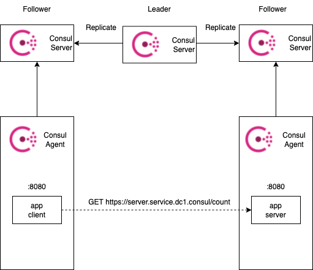
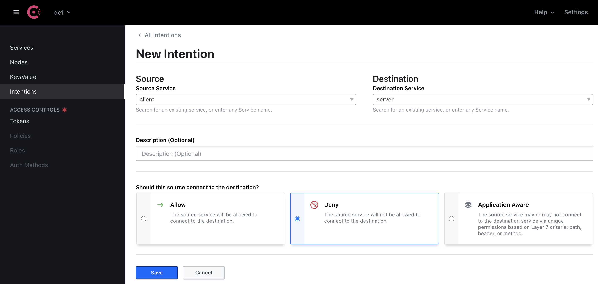
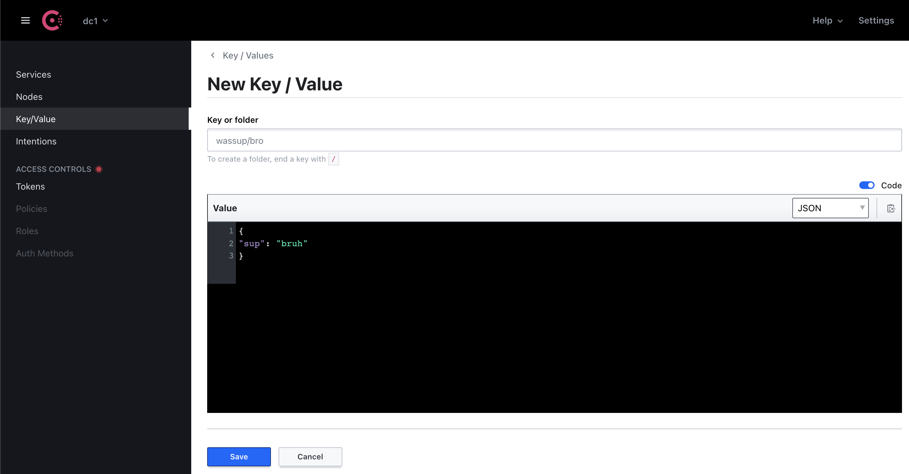
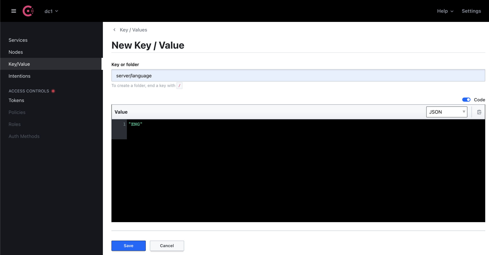

# SOA-101-service-mesh

## Consul Reference Architecture


## Connect-Native App Integration

Service mesh using Consul Connect-Native

[Service Mesh - Connect-Native App Integration](https://www.consul.io/docs/connect/native)

[Service Mesh - Connect Configuration](https://www.consul.io/docs/connect/configuration)

[Service Mesh - Connect-Native App Integration With Go](https://www.consul.io/docs/connect/native/go)

## DNS Interface

Consul service discovery DNS

[DNS Interface](https://www.consul.io/docs/discovery/dns)

## Demo

Run:

```bash
make run
```

Test API:

```bash
# Send get request to counting client
$ curl localhost:8081/
{"count":2,"hostname":"4b2a8b9fd305"}

# Query server address
$ curl localhost:8081/query
192.168.208.7:8080
```



## Intentions

[Service Mesh - Intentions](https://www.consul.io/docs/connect/intentions)

Test intentions Client --x--> Server:



Test API:

```bash
# Send get request to counting client
$ curl localhost:8081/
Connect to server failed: Get "https://server.service.dc1.consul/count": 
remote error: tls: bad certificate
```

## Key/Value Store

Centralized configuration.

### Example 1

Go to Consul UI:



Test API:

```bash
# Send get request to counting client
$ curl localhost:8081/kv?token=wassup/bro
wassup/bro: {
  "sup": "bruh"
}

$ curl localhost:8081/kv?token=not/exist
Value not found for key: not/exist
```

### Example 2

Go to Consul UI:



Test API

```bash
# Send get request to counting client
$ curl localhost:8081/
{"count":5,"hostname":"4b2a8b9fd305","language":"ENG"}
```

## TODO

- gRPC
- Broker/Message Queue
- Service mesh using Envoy
- Service mesh in kubernetes
- API Gateway
- Monitoring
